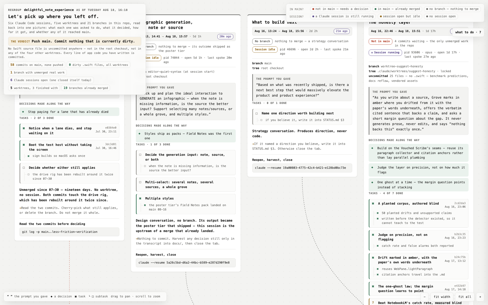
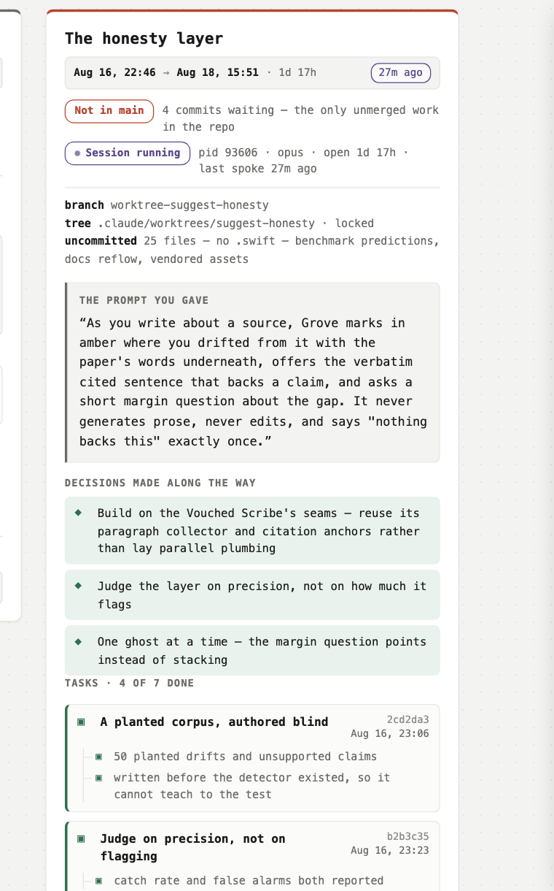
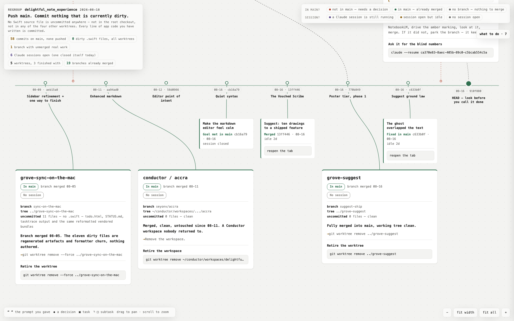

<h1 align="center">regroup</h1>

<p align="center">
  <strong>Pick up where you left off.</strong><br>
  Every branch, worktree and open Claude Code session in one canvas · what you asked for · whether it landed.
</p>

<p align="center">
  
</p>

`git branch` gives you a list of names. This gives you back your own head.

After a few days away, the thing you are missing is not information — it is
**reassembly**. Git knows commits but not intent. Transcripts hold intent but are
unreadable. The mapping between *this terminal tab*, *this branch*, and *what I was
trying to do* lives only in your head, and it decays in about three days.

`regroup` rebuilds that mapping from evidence that already exists on disk:

- **What was I doing?** The prompt you actually typed, verbatim, per session — the sentence that makes you go "oh, _that_."
- **Did any of it land?** 21 branches, 19 already merged, **1** holding unmerged work. That one is the only real decision on the board.
- **Which tabs can I close?** 6 sessions still running, oldest open 5 days. Three of them had their goal met by a later branch they never knew about.
- **Is anything at risk?** 58 commits on `main` never pushed. And **0** dirty `.swift` files across all five worktrees — nothing you wrote is uncommitted.

It only reads. It writes nothing to your repo, runs no git commands that mutate,
and adds no instrumentation anywhere — every number comes from logs and objects
that already existed.

---

## Install

**In Claude Code** — gives you the `/regroup` command:

```
/plugin marketplace add seyonv/regroup
/plugin install regroup
```

**On the command line:**

```bash
git clone https://github.com/seyonv/regroup ~/src/regroup
python3 ~/src/regroup/scripts/collect.py /path/to/your/repo > state.json
```

Python 3.10+. Standard library only — no dependencies, no build step, nothing to
configure. It finds `~/.claude` on its own.

---

## What you get

### A canvas, because the shape of the work is the point

`main` runs as a horizontal rail with a node per merge. Open work hangs above it on
dashed wires; retired worktrees sit below on solid ones. Sessions whose work already
landed become small tombstones directly under the merge that absorbed them — present,
but no longer competing for your attention.

The page **is** the canvas. Title, legend and actions float in a small HUD you can
pan underneath.

### Each card is the context you lost, in four shapes



| shape | meaning |
|---|---|
| `“ ”` quote block | the prompt you gave, **verbatim** |
| `◆` diamond, tinted | a decision made along the way |
| `▣` bordered node | a task, with its commit sha and date |
| `└ □` on a spine | a subtask |

State glyphs stay constant at every depth: `▣` done, `?` unknown, `□` open.

`?` is deliberate and load-bearing. It means a bar was set and never demonstrably
met — "beat NotebookLM's catch rate" with the subtask "no round has been reported as
won" underneath. A checklist that only has ✓ and ☐ has to lie about that case.

<br clear="right">

### Two questions, never collapsed into one badge

**Is it in main?** and **is a session still running?** are independent. A single
"live" badge answers neither.

Every card carries both, always:

```
Not in main       4 commits waiting — the only unmerged work in the repo
● Session running  pid 93606 · opus · open 1d 17h · last spoke 27m ago
```

The card's top edge and its wire to the rail both encode the **landing** answer.
Colour never means "a session is alive."

### Dates you can read without finding the timeline

Every card opens with a clock strip — `opened → last touched · how long open`, with
a relative badge that runs violet when it is minutes and rust when it is over five
days. Tasks carry their commit date next to the sha. You can be zoomed into a
corner of the canvas and still know exactly when.

### A control surface, not just a map



Every card carries the one command that acts on it, click to copy:

```
claude --resume ca370e83-8aec-405b-89c0-c5bcab554c5a   # reopen that exact session
git worktree remove ../grove-suggest                    # retire a finished tree
git log -p main..less-friction-verification             # judge unmerged work
```

The resume UUIDs are real — they are the transcript filenames.

---

## How it works

### Three sources, cross-checked

| source | gives |
|---|---|
| `git` | worktrees, branches, merge-base state, dirty files, unpushed commits |
| `ps` + `lsof` | running `claude` processes, their working directory, their launch prompt |
| `~/.claude/projects/*/*.jsonl` | each session's opening ask, turn count, last activity |

### Matching a terminal tab to what it was doing

This is the part that makes the rest possible. A running `claude` process knows its
cwd but not its transcript; a transcript knows its prompt but not its pid. `regroup`
matches them by **start time** — process elapsed time from `ps` against the
transcript's first entry timestamp — claiming nearest-first so two sessions never
take the same transcript.

On the repo in these screenshots, all 7 processes matched within **4 seconds** of
their transcript's first message.

Without this you can only guess which of six identical terminal tabs holds the work
you care about.

### Facts are collected; judgment is written

`collect.py` never interprets. It emits JSON. An agent (or you) then writes
`regroup.json` — the reading of that evidence: which workstreams matter, what the
tasks were, whether a bar was met, what command acts on it. `render.py` draws
whatever it is given.

That split is the whole architecture. The scriptable part is scripted, the part that
needs judgment is authored, and the drawing is data-driven so neither one has to
change when the other does.

### Classifying dirty files before saying anything about them

A dirty-file count is meaningless on its own. `regroup` separates formatter damage to
vendored bundles, regenerated build output, large untracked directories that need
`.gitignore` before any `git add -A`, and actual authored source — then counts dirty
files **by extension**, because "0 dirty `.swift` files anywhere" is the single most
reassuring sentence in the report and it is cheap to verify.

---

## Reference

```
scripts/collect.py <repo-root>          # facts -> JSON on stdout
scripts/render.py  <data.json> <out.html>
skills/regroup/SKILL.md                 # the workflow, schema, and design rules
example/regroup.json                    # a real, complete board to copy from
```

`regroup.json` schema is documented in full in
[`skills/regroup/SKILL.md`](skills/regroup/SKILL.md).

The rendered page is one self-contained HTML file: no external requests, no fonts to
fetch, works from `file://`, and respects `prefers-color-scheme` and
`prefers-reduced-motion`.

---

## Known limitations

- **macOS and Linux.** Process discovery uses `ps` and `lsof`. Windows is not handled.
- **The judgment layer is not automatic.** `collect.py` gives you facts; turning them
  into tasks, subtasks and verdicts is a real read of the evidence. The skill exists to
  guide an agent through it — but a bare `collect.py` run is an inventory, not a board.
- **Layout columns are hand-placed.** `gcol` and `span` are authored per workstream on
  an 8-column grid. Above roughly eight open workstreams you will want to widen the
  grid or promote some to tombstones.
- **Facts go stale in minutes.** A session can exit while you are reading. Re-run
  `collect.py` before re-rendering; if a pid has vanished, say so on the card rather
  than dropping it silently. A board that admits it changed is more trustworthy than
  one that pretends it did not.
- **Transcript format is Claude Code's, and undocumented.** `collect.py` reads it
  defensively and degrades to "no intent found" rather than failing.

## Tests

```bash
python3 -m unittest discover -s tests -v
```

Covers the parts with real edge cases: `ps` elapsed-time parsing across all three
formats (`MM:SS`, `HH:MM:SS`, `DD-HH:MM:SS`), the project-directory slug, duration
humanising, and the nearest-first session↔transcript matcher including the case where
two sessions compete for one transcript.

## License

MIT
